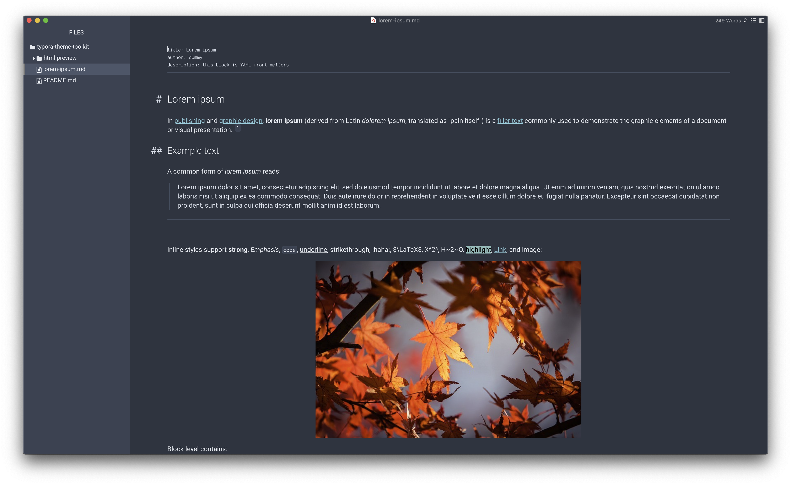
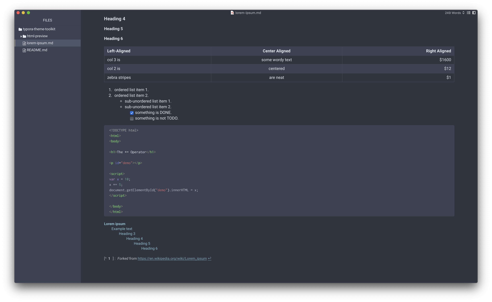

# Nord theme for Typora
Minimalistic theme using [Nord palette](https://www.nordtheme.com/) based on the [Quartz Theme](https://github.com/troennes/quartz-theme-typora).

## Installation
1. On the Github press *Code*, select *Download ZIP*
2. Go to Typora Preferences, select "Open Theme Folder".
3. Copy or move contents of `theme/` into the newly opened folder.
4. Restart Typora, then select it from Themes menu.

## Known issues
- colors in the *Focus Mode* should be fixed